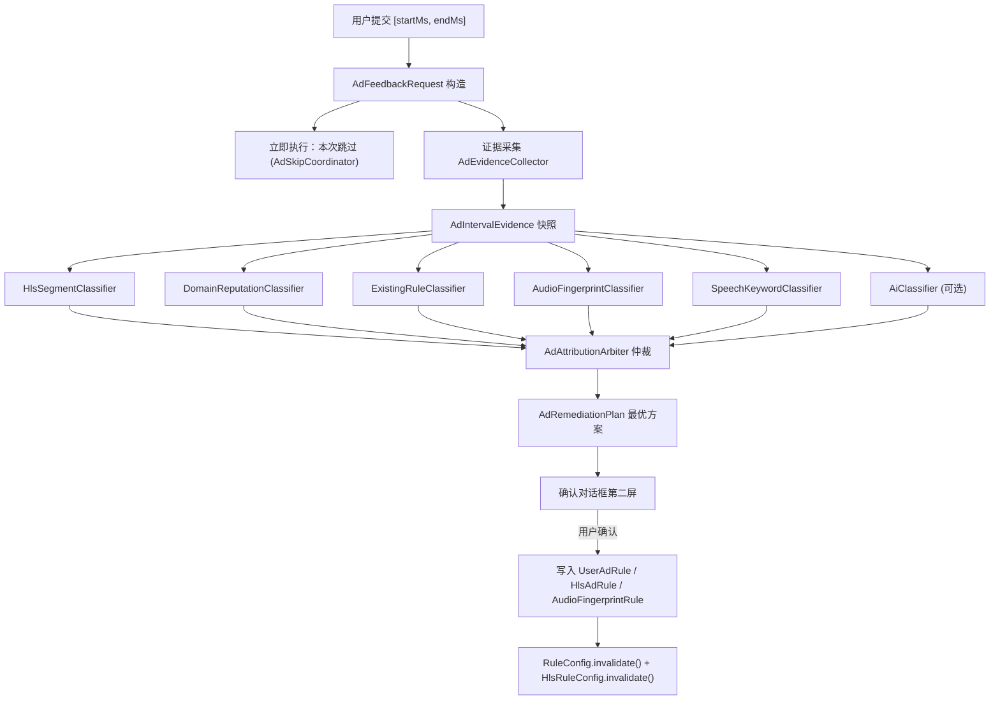

# 「有广告」按钮升级：区间反馈与多通道综合归因设计

## 1. 文档状态

- 状态：提议（Proposed），待用户批准分阶段实施
- 版本：v0.1
- 日期：2026-08-29
- 适用范围：播放器「有广告」按钮、广告归因分类器、候选规则落地、本次播放即时跳过
- 上游文档：`智能去广-设计文档.md`（V2 总设计）、`docs/AI_AD_DETECTION_DESIGN.md`、`docs/audio-fingerprint-phase0-implementation.md`、`docs/interface-ad-rule-learning-design.md`
- 已确认决策：候选落地采用「本次立即跳过 + 同时生成待审候选」；通道分阶段接入；规则纯本地，不上传、不众包

## 2. 背景

### 2.1 现状

「有广告」按钮当前是**单通道**的：点击后只做一件事 —— 把站点元数据 + m3u8 切片摘要送给用户自配的 AI 端点，让大模型猜 `hosts` / `regex` / `exclude`，然后弹 `AdRulePreviewDialog` 让用户确认写入 `UserAdRule`。

三处入口（`app/src/leanback/.../VideoActivity.java:3982`、`app/src/mobile/.../VideoActivity.java:8661`、`app/src/main/.../TmdbDetailActivity.java:8286`）是三份几乎逐字重复的实现。

显示门槛是四个条件的与：
```java
Setting.isAiConfigReady() && Setting.isAdblock()
        && Setting.isAiAdDetection() && isAdFeedbackSupportedFormat()
```
其中 `isAiAdDetection()` 默认关闭（`Setting.java:868`），`isAdFeedbackSupportedFormat()` 要求 `MediaSourceFactory.isHlsUrl(url)`。**即按钮默认不可见，且强绑 AI。**

### 2.2 三个具体缺陷

1. **反馈粒度只有「这一集有广告」**。用户明明知道广告在 02:15–02:45，这个信息被完整丢弃。分类器只能拿到整条 playlist 的统计特征，无法定位。
2. **项目已有的其他检测能力完全没有参与**。仓库里已落地 HLS 结构化净化（`HlsManifestCleaner`，318 行）、音频频谱指纹（`ad/audio/` 41 个类，8000+ 行）、语音关键词（`SpeechAdSignalProvider`）、域名黑名单（`RuleConfig`）、接口规则学习（`InterfaceAdRuleAnalyzer`）—— 但「有广告」按钮一个都不用，只调 AI。
3. **用户反馈完了什么都没得到**。当前流程最好的结果是「下次播放可能不再有广告」。本次播放的广告仍然要看完。

### 2.3 一个必须先修的既有问题

`HlsAdblockPipeline.apply()` 在两个调用点（`server/process/M3u8.java:91`、`androidx/media3/mpvplayer/MpvHlsProxy.java:799`）都传 `legacyFallback=true`。结构化规则未命中时会回落到预编译 AAR 里的 `HlsAdsParser.process()` —— 那是一套**没有规则、没有安全阈值、按众数块大小猜少数派**的启发式引擎。

由于内置的 3 条 HLS 规则全部 `enabledByDefault: false`（`assets/rules/hls_rules.json`），**当前线上实际生效的去广主力是这套启发式，而不是文档重点描述的结构化引擎。** 本设计的归因结论必须能区分「广告是被启发式删掉的」和「被结构化规则删掉的」，否则证据链是错的。

## 3. 目标与非目标

### 3.1 目标

1. 用户可提交广告的**开始/结束时间**，而不只是「有广告」这一个 bit。
2. APP 用**已有的全部检测能力**对该区间做归因分类，输出「这段广告属于哪一类、最适合用哪种机制拦掉」。
3. 分类结论按可靠性排序，选出**成本最低且证据最强**的那一种去广方式，而不是无脑走 AI。
4. 用户提交后**当次播放立即跳过该区间**，不等分类完成。
5. 分类产出的规则进入待审候选，用户确认后长期生效。
6. 不引入服务端；不上传播放行为；AI 仍然可选且可完全关闭。
7. 按钮在**关闭 AI 时也可用**（降级为纯本地归因）。

### 3.2 非目标

1. 不做视觉识别 / OCR / 帧分析。当前仓库无此能力，引入代价与收益不成比例。
2. 不建服务端，不做跨用户众包聚合，不上报任何播放数据（承接现有「不承诺」清单）。
3. 不为直播实现区间反馈（直播无稳定时间轴，`HlsManifestCleaner` 对 live 也只允许删连续头部分片）。
4. 不承诺 IJK / MPV 的音频指纹通道（现有限制照旧，仅 Exo 支持 PCM 捕获）。
5. 不自动启用高风险规则（宽泛固定时长、全文正则）。
6. 不改动 `HlsAdsParser`（在预编译 AAR 内，属于 upstream 依赖，改它要走 `E*` 任务流程）。

## 4. 用户交互设计

### 4.1 区间采集：三种输入路径

单个按钮承担不了区间输入。改为**长按/短按分流 + 一个轻量标记条**。

| 操作 | 行为 | 适用 |
|---|---|---|
| 短按「有广告」 | 以当前位置为**结束时间**，向前回溯猜测开始时间（见 4.2），直接进入确认 | 广告刚放完，用户反应过来了。最常见 |
| 长按「有广告」 | 进入**标记模式**：第一次确认打起点，第二次确认打终点 | 广告正在放，用户想精确框选 |
| 标记模式中再次长按 | 取消标记 | 误触 |

TV（leanback）端焦点资源紧张，长按走 `OnLongClickListener`；移动端同时在标记模式下于进度条上叠加区间高亮，允许拖动微调两个端点。

### 4.2 短按的起点推断

短按只有一个时间点。起点按优先级推断，第一个成功的即采用：

1. **最近一次 `DISCONTINUITY` 边界**。从 `M3u8Evidence.discontinuities` 找当前位置之前最近的断点，落在其上。这是最可靠的信号 —— 硬插广告几乎总带断点。
2. **最近一次跨域切换点**。`M3u8Evidence.domainSwitches` 中当前位置前最近的 `true`。
3. **最近一次音频/语音候选的 `startTimeMs`**。若 `AdSkipCoordinator` 在 `SUPPRESSED` 或 `UNDO_WINDOW` 状态持有过候选，直接复用。
4. **固定回溯窗口**。默认 90 秒，钳制到 `[0, 当前位置)`。

推断出的起点必须在确认对话框里**明示并可调**，不能静默使用。文案示例：「广告区间 02:15 – 02:45（起点由切片断点推断）」。

### 4.3 确认对话框

复用并扩展 `AdRulePreviewDialog`（leanback / mobile 各一份）。分两个阶段展示：

```
第一屏（提交即出，< 100ms）
  广告区间  02:15 – 02:45  (30.0s)     [调整] [确认]
  ☑ 本次播放立即跳过这段

第二屏（归因完成后原地替换内容，通常 1–3s，含 AI 时可能 10s+）
  归因结果：切片跨域 + 固定时长（置信度 0.82）
  建议方式：HLS 结构化规则  [风险：中]
    hostSuffixes: ad-cdn.example.com
    durationRange: 6.40 – 6.47
    requireDiscontinuity: true
    minimumSignals: 2
  证据：区间内 5 个切片全部来自 ad-cdn.example.com，
        主 playlist 域名为 v.example.com；区间前后各有一个
        #EXT-X-DISCONTINUITY；切片时长标准差 0.02s
  [保存为规则] [仅本次跳过] [丢弃]
```

「本次播放立即跳过」默认勾选，勾选状态即视为对**本片段本次执行**的授权，与「保存为规则」的长期授权分离。这是决策 A 的落点。

### 4.4 按钮可见性放宽

```java
// 新条件：去广总开关 + 可定位的时间轴，AI 不再是硬门槛
private boolean isAdFeedbackEnabled() {
    return Setting.isAdblock()
            && !isLive()
            && getDuration() > 0
            && isSeekable();
}
```

AI 从「按钮显示前置条件」降级为「归因通道之一」。关闭 AI 时按钮仍可用，只是少一个通道。HLS 格式也不再是硬门槛 —— 非 HLS 时 HLS 通道自然弃权，音频/语音通道仍可工作。

## 5. 总体架构



### 5.1 模块职责

| 模块 | 职责 | 不负责 |
|---|---|---|
| `AdFeedbackController` | 三端共用的编排器：接收区间、触发立即跳过、调度分类、驱动对话框 | 具体分类逻辑 |
| `AdEvidenceCollector` | 采集区间证据快照，一次性、幂等、可缓存 | 判断是不是广告 |
| `AdIntervalClassifier`（接口） | 单通道分类，输出 0..n 个 `AdAttribution` 或弃权 | 跨通道比较 |
| `AdAttributionArbiter` | 合并、去重、置信度融合、成本排序，选出最优方案 | 写规则 |
| `AdRemediationPlanner` | 把仲裁结论翻译成具体规则对象（`HlsAdRule` / `UserAdRule` / `AudioFingerprintRule`） | 落盘 |
| `AdFeedbackDiagnostics` | 固定枚举计数，不记 URL / 规则正文 | 上报 |

### 5.2 三端去重

现有三份重复实现是这次改造的最大阻力。新逻辑**全部放进 `app/src/main/` 的 `AdFeedbackController`**，三端 Activity 只保留：

```java
// 每端约 15 行
mAdFeedback = new AdFeedbackController(new AdFeedbackController.Host() {
    public long positionMs() { return mPlayer.getPosition(); }
    public long durationMs() { return mPlayer.getDuration(); }
    public String playUrl() { return mPlayer.getUrl(); }
    public Map<String,String> headers() { return mPlayer.getHeaders(); }
    public AdSkipCoordinator skipCoordinator() { return mPlayer.adSkipCoordinator(); }
    public void showDialog(AdFeedbackSession s) { AdRulePreviewDialog.create(s).show(this); }
    public String vodName() { /* 三端唯一真正不同的地方 */ }
});
```

现有 `testMobile` 下的 `PlayerPlaybackRegressionSourceTest` / `TmdbDetailActivityLayoutTest` 用**源码文本断言**锁定了三端的方法名，改动时必须同步更新这两个测试的期望字符串，否则构建失败。

## 6. 数据契约

### 6.1 区间证据

```java
public record AdIntervalEvidence(
        long startMs, long endMs, StartOrigin startOrigin,
        // 播放上下文（沿用 AdDetectionRequest 的去敏原则）
        String siteKey, String siteName, String vodName,
        String flagName, String episodeName,
        String playlistHost, String urlPath, boolean hls,
        // HLS 切片证据（区间内 + 区间外对照）
        List<SegmentFact> inside, List<SegmentFact> outside,
        boolean boundedByDiscontinuity, boolean crossDomain,
        // 已有机制的自述
        List<String> alreadyRemovedByStructuredRuleIds,
        boolean legacyHeuristicActive,
        List<String> matchedExistingHosts,
        // 音频/语音
        AudioIntervalFact audio, SpeechIntervalFact speech) {}

public record SegmentFact(int index, String host, String path,
                          double durationSec, boolean discontinuityBefore) {}
```

`StartOrigin` 枚举：`USER_MARKED` / `DISCONTINUITY` / `CROSS_DOMAIN` / `AUDIO_CANDIDATE` / `FALLBACK_WINDOW`。仲裁时 `USER_MARKED` 与 `DISCONTINUITY` 的证据权重高于 `FALLBACK_WINDOW`。

`alreadyRemovedByStructuredRuleIds` 与 `legacyHeuristicActive` 直接回答 2.3 的问题：如果用户报告的区间**在净化后的 manifest 里已经不存在**，说明广告来自别处（例如 WebView 层没拦住的贴片、或播放器外层），归因结论应当是「HLS 通道弃权」而不是「再加一条 HLS 规则」。

### 6.2 归因与方案

```java
public record AdAttribution(
        String channelId,          // "hls" / "domain" / "existing-rule" / "audio" / "speech" / "ai"
        AdCategory category,
        float confidence,          // 0..1，通道内自评
        RiskLevel risk,            // LOW / MEDIUM / HIGH，沿用 V2 总设计的三级
        List<String> evidence,     // 人类可读，进 UI
        RemediationKind remediation) {}

public enum AdCategory {
    THIRD_PARTY_CDN_SEGMENT,   // 切片来自非主流/非当前适配域名
    FIXED_DURATION_BLOCK,      // 固定时长硬插块
    DISCONTINUITY_BLOCK,       // 断点包裹的独立块
    KNOWN_AD_HOST,             // 命中已知广告域名
    AUDIO_FINGERPRINT,         // 音频频谱指纹匹配
    SPEECH_KEYWORD,            // 语音关键词
    IN_STREAM_BURNED_IN,       // 压制进正片，无结构特征
    ALREADY_HANDLED,           // 已被现有规则处理，用户看到的是别的东西
    UNKNOWN
}

public enum RemediationKind {
    HLS_STRUCTURED_RULE,   // → HlsAdRule
    HOST_BLACKLIST,        // → UserAdRule.hosts
    URL_REGEX_RULE,        // → UserAdRule.regex
    AUDIO_FINGERPRINT_RULE,// → AudioFingerprintRule
    SPEECH_KEYWORD,        // → SpeechAdSetting keywords
    SESSION_SKIP_ONLY,     // 只能本次跳过，无法泛化
    NONE
}
```

`AdRemediationPlan` = 首选 `AdAttribution` + 生成好的规则对象 + 备选方案列表。UI 展示首选，「更多方式」可展开备选。

## 7. 各通道分类逻辑

### 7.1 HlsSegmentClassifier（Phase 1，零新增成本）

输入已有：`M3u8Parser.parse()` 已经产出 `segments` / `discontinuities` / `durations` / `domainSwitches`。缺的只是**把播放时间映射到切片下标** —— 用 `durations` 前缀和即可，不需要新的网络请求。

```
cum[0]=0; cum[i+1]=cum[i]+durations[i]
区间内切片 = { i : cum[i+1] > startSec && cum[i] < endSec }
```

判定信号（沿用 `HlsManifestCleaner.Rule` 已支持的六项，保证生成的规则一定能被现有引擎执行）：

| 信号 | 判据 | 权重 |
|---|---|---|
| 跨域 | 区间内切片 host ≠ playlist host，且区间外切片 host = playlist host | 0.35 |
| 断点包裹 | 区间起止各有 `#EXT-X-DISCONTINUITY` | 0.25 |
| 时长离群 | 区间内切片时长标准差 < 0.05s 且与区间外众数时长差 > 0.5s | 0.20 |
| 路径特征 | 区间内切片路径命中 `/ads?/`、`/preroll/`、`/creative/` 等保守模式 | 0.15 |
| 位置 | 区间落在 playlist 头部 15% 以内 | 0.05 |

置信度 = 命中权重之和。`minimumSignals` 按命中信号数取 `max(2, 命中数)`，**永不生成 `minimumSignals: 1` 的规则** —— 内置规则策略明确禁止只凭固定时长删片。

生成的 `HlsAdRule` 必须带 `playlistHostSuffixes`（限定到当前站点的 playlist 域名），把规则作用域收窄，避免污染其他站点。

**弃权条件**：非 HLS；区间内切片数为 0；`alreadyRemovedByStructuredRuleIds` 非空且覆盖了整个区间；置信度 < 0.30。

### 7.2 DomainReputationClassifier（Phase 1，零新增成本）

「非当前适配的主流域名」这条需求落在这里。三层比对：

1. **命中现有黑名单**：区间内切片 host 命中 `RuleConfig.get().getAds()`（VOD `ads` + Live `ads` + 用户规则 hosts）→ `KNOWN_AD_HOST`，置信度 0.95，但同时标记 `ALREADY_HANDLED`：既然已在黑名单里，用户还是看到了广告，说明拦截路径没覆盖到播放器直连的切片请求（黑名单目前主要在 `CustomWebView.shouldInterceptRequest` 生效，不拦播放器的切片）。这个结论本身就有价值 —— 建议改用 `HLS_STRUCTURED_RULE`。
2. **与站点适配域名对比**：从当前站点最近若干次成功播放的 playlist host 归纳出「本站正常域名集合」（新增一个小的本地 LRU，见 8.3）。区间内 host 不在其中 → `THIRD_PARTY_CDN_SEGMENT`。
3. **命中接口学习候选**：比对 `ImportedAdRuleCandidateStore` 里状态为待审的候选。若命中，说明接口维护者也认为这是广告域名 → 置信度 +0.15，并在证据里注明来源接口名。这条把 `InterfaceAdRuleAnalyzer` 的既有产出接进了反馈闭环。

生成 `UserAdRule.hosts`。风险等级 LOW（域名黑名单是最安全的机制）。

### 7.3 ExistingRuleClassifier（Phase 1，零新增成本）

回答「为什么现有机制没拦住」。检查四件事并写进证据，本身不产出规则（`RemediationKind.NONE`），但会**否决**其他通道的错误结论：

1. 内置 3 条 HLS 规则是否因 `enabledByDefault: false` 而未启用，且其 `hostSuffixes` 恰好匹配本区间 → 建议「启用规则 X」而不是新建规则。这是成本最低的修复。
2. `legacyHeuristicActive` 为真且区间内切片是被启发式删掉后**又出现**的 → 启发式判错，需要 exclude 保护。
3. 是否有 `UserAdRule.exclude`（正片保护正则）误保护了广告切片。
4. 区间是否已被某条规则处理过（查 `AdBlockStats.ruleCounts` 的最近命中）。

### 7.4 AudioFingerprintClassifier（Phase 2）

Phase 1 只**读**已有匹配结果（若音频指纹已开启且区间内有 `MatchEvent`，直接采信，置信度 0.90，`RemediationKind.AUDIO_FINGERPRINT_RULE` 但规则已存在故降为证据）。

Phase 2 才做**新指纹采集**，这是真正的能力增量：用户框选的区间就是天然的指纹样本源。

```
1. AdSkipCoordinator 在 UNDO_WINDOW / 提交瞬间，向 PlaybackMediaSignalHub
   申请 ConsumerKind.AD_AUDIO 的 CaptureLease（若尚未持有）
2. 若区间已过去 → 不重放，走「下次遇到再采集」：把区间描述存为
   PendingFingerprintCapture，下次同一 siteKey + 同一 flagName 播放
   到相近位置时自动采集
3. 若区间尚未播完（长按标记模式下常见）→ 直接从 Hub 的 PcmFrame 流采集
4. SpectralFingerprint.extractVariants(samples, 16000, 1, ...) 产出 4 个相位变体
5. 组装 AudioFingerprintRule{id, durationMs, anchorOffsetMs, anchorDurationMs,
   fingerprint, variants}，经 AudioFingerprintRuleCodec 严格校验后
   写入 AdAudioRuleStore（files/ad-audio-rules.json，2MiB 上限）
```

约束（全部继承自现有实现，不放松）：
- 仅 Exo；仅点播；仅时长已知且可 seek
- 采集不改变现有「必须用户确认才 seek」的策略
- 锚点长度取区间前 3 秒（`anchorDurationMs` 上限），不存整段广告音频
- **不存原始 PCM**，只存 32-bit hash 序列。这一点对隐私和体积都关键
- 新指纹默认 `PROMPT` 模式，不自动跳

跨规则碰撞检查：新指纹与已有规则做汉明距离比对，过近则拒绝写入并提示「已有相同规则」，避免规则库膨胀。

### 7.5 SpeechKeywordClassifier（Phase 2）

若语音通道已开启且区间内有识别文本，提取候选关键词。**但不自动加入关键词表** —— 关键词是全局生效的，一个错误关键词会在所有片子上乱跳。只做建议，且：
- 只建议在多个不同片源的反馈中重复出现的词（需要一个本地计数，阈值 3 次）
- 建议词展示时不显示完整识别文本（现有实现刻意不打印命中关键词，保持一致）

### 7.6 AiClassifier（Phase 3，可选）

复用 `AiAdDetectionService`，但输入升级：

```
现在只送：站点/剧名/线路/集名/域名/路径 + 全 playlist 切片摘要
升级后送：上述 + 用户框选区间 + 区间内外切片对照 + 其他通道的初步结论
```

关键变化是 **AI 从「唯一裁判」变成「兜底解释者」**。它只在以下情况被调用：
- 其他所有通道置信度均 < 0.50，或
- 用户在第二屏主动点「让 AI 再看看」

理由：本地通道有确定性证据时，大模型的输出只会引入噪声和延迟；而本地通道全部弃权时（`IN_STREAM_BURNED_IN` 场景），AI 至少能给出人类可读的解释。

`AiConfig` 未配置时静默弃权，不报错。AI 输出的规则**永远进待审**，绝不自动启用（决策 D 不变）。

## 8. 仲裁与置信度

### 8.1 成本-可靠性排序

仲裁不是简单取最高置信度，而是在**同等置信度下优先选成本更低、风险更小的机制**：

| 机制 | 运行时成本 | 风险 | 泛化能力 | 排序权重 |
|---|---|---|---|---|
| 启用已有内置规则 | 零 | 低 | 高 | 1（最优） |
| 域名黑名单 | 极低 | 低 | 中 | 2 |
| HLS 结构化规则 | 低（P95 < 50ms） | 中 | 高 | 3 |
| URL 正则规则 | 低 | 中 | 中 | 4 |
| 音频指纹 | 中（PCM 管线 + FFT） | 中 | 仅同一广告素材 | 5 |
| 语音关键词 | 高（Sherpa-ONNX 常驻） | 高（全局误伤） | 低 | 6 |
| 本次跳过 | 零 | 低 | 无 | 7（兜底） |

最终得分 = `confidence × 0.7 + (1 - 归一化排序权重) × 0.3`。`ALREADY_HANDLED` 类别强制降权到最后。

### 8.2 冲突处理

- 多通道指向**同一** `AdCategory`：置信度取 `1 - Π(1 - cᵢ)`（概率或），证据合并
- 多通道指向**不同** category：全部保留，按 8.1 排序，UI 展示首选 + 「更多方式」
- 任一通道给出 `ALREADY_HANDLED`：整体降级为「诊断结论」，首选动作变成「本次跳过 + 上报诊断到本地日志」，不新增规则。避免规则库被无效规则污染

### 8.3 站点域名基线（新增最小存储）

`SitePlaylistHostBaseline`，SharedPreferences，每站点保留最近 8 个成功播放的 playlist host + 切片 host，LRU 淘汰。仅用于 7.2 的第 2 层比对。

不存 URL 全文、不存 query、不存 token，只存 host 字符串。单站点上限 8，全局上限 200 站点，超限按最久未用淘汰。

## 9. 立即跳过的执行

这是「本次立即跳过」决策的落点。复用 `AdSkipCoordinator` 而不是新写 seek 逻辑，因为它已经处理了所有难的部分：session/generation 校验、时钟新鲜度、直播拒绝、不可 seek 拒绝、5 秒撤销窗口。

新增一条入口：

```java
// AdSkipCoordinator 新增
public synchronized boolean onUserInterval(long startMs, long endMs, String feedbackId);
```

与现有 `onCandidate` / `onAutoCandidate` 的区别：
- 用户已经显式授权，跳过 `PROMPT_PENDING` 直接进 `SEEKING`
- 但**仍然执行全部安全校验**：session/generation 匹配、`endMs < durationMs`、可 seek、非直播。任一失败则 `diagnostics.record(SEEK_REJECTED)` 并降级为「已记录，未跳过」
- 保留 5 秒 `UNDO_WINDOW`。用户框错了要能立刻回去
- 若 `endMs` 已过（短按场景，广告已放完）→ 不 seek，只记录，第一屏文案改为「已记录该区间」

**同一区间的重复提交**要幂等：以 `(sessionId, startMs/1000, endMs/1000)` 为键去重，避免用户连按导致多条候选。

## 10. 安全与隐私

继承现有边界，并针对本次新增的数据做收紧：

1. **区间时间戳不出设备**。除了用户自配的 AI 端点（Phase 3，且用户显式开启），无任何网络出口。
2. **AI 输入去敏**：只送 host + 去参数 path + 时长数组 + 断点下标。不送完整 URL、query、token、Cookie、Authorization。现有 `AdDetectionRequest` 已遵守此约定，扩展字段沿用。
3. **`AiDebugLog` 的落盘风险需要处理**。现有 `AiAdDetectionService.java:44,50,58` 会把完整 prompt 与响应写本地日志。区间反馈会让 prompt 包含更多播放上下文。建议：debug 日志只在 debug 构建启用，或对 host 做哈希化。这是一个既有问题，本设计不扩大它。
4. **音频指纹不存 PCM**，只存 hash 序列（7.4）。
5. **正则安全**：任何生成的正则在写入前必须过 `InterfaceAdRuleAnalyzer` 已有的危险模式检查（嵌套量词、反向引用），并预编译验证。复用现有实现，不新写。
6. **规则作用域强制收窄**：反馈生成的 `HlsAdRule` 必须带 `playlistHostSuffixes`，`UserAdRule` 必须带 `siteKey`。禁止生成全局生效的规则。

## 11. 可观测性

沿用 `AdAudioDiagnostics` 的「固定枚举计数，不记敏感内容」模式，新增 `AdFeedbackDiagnostics.Code`：

```
INTERVAL_SUBMITTED, START_INFERRED_FROM_DISCONTINUITY,
START_INFERRED_FROM_FALLBACK, IMMEDIATE_SKIP_APPLIED,
IMMEDIATE_SKIP_REJECTED, EVIDENCE_COLLECT_FAILED,
CHANNEL_ABSTAINED, ARBITER_NO_PLAN, PLAN_ACCEPTED,
PLAN_DISCARDED, DUPLICATE_SUBMISSION, ALREADY_HANDLED_DETECTED
```

`AdBlockStats` 扩展三个计数（沿用现有 SharedPreferences 存储，不建表）：
- `intervalFeedbackCount` — 区间反馈次数
- `intervalSkipApplied` — 成功立即跳过次数
- `planAcceptedByKind` — 按 `RemediationKind` 统计被采纳的方案分布

最后一项是**衡量本设计是否成功的核心指标**：如果一年后 `SESSION_SKIP_ONLY` 占比仍然最高，说明归因基本没用，应当回退简化。

## 12. 测试策略

### 12.1 单元测试（Phase 1 必须）

- `AdEvidenceCollectorTest`：时间→切片下标映射，含边界（区间恰好落在切片边界、区间跨越 `EXT-X-DISCONTINUITY`、`durations` 缺失）
- `HlsSegmentClassifierTest`：五种信号的正样本各一、反样本各一；「区间内外同域名」必须弃权而非误判
- `DomainReputationClassifierTest`：三层比对；`ALREADY_HANDLED` 的识别
- `ExistingRuleClassifierTest`：内置规则未启用时建议启用而不是新建
- `AdAttributionArbiterTest`：同 category 概率或、跨 category 排序、`ALREADY_HANDLED` 强制降权
- `AdSkipCoordinatorTest` 扩展：`onUserInterval` 的 session/generation 拒绝路径、`endMs` 已过的降级、重复提交幂等

### 12.2 样本回归（Phase 1 必须）

复用现有 `app/src/test/resources` 的 manifest 样本模式，为三条内置实验规则（暴风 / 量子 / 非凡）各准备一组：真实 manifest + 用户区间 + 期望归因结论。这些样本已有正/反样本，成本低。

### 12.3 Phase 2 追加

- `SpectralFingerprint` 黄金 PCM 向量端到端比对（`docs/ad-audio-fingerprint-sdk-evaluation.md` 4.1 节的既有待办，Phase 2 必须先关掉）
- 指纹碰撞检查：新采集指纹与已有规则过近时拒绝写入
- `PendingFingerprintCapture` 的跨会话恢复

### 12.4 三端一致性

现有 `PlayerPlaybackRegressionSourceTest` / `TmdbDetailActivityLayoutTest` 靠源码文本断言锁定三端方法名。改造为 `AdFeedbackController` 后，这两个测试的期望字符串必须同步更新，且新增一条断言：三端**不得**各自持有 `submitAdFeedback` / `buildAdDetectionRequest` 的实现（防止重复实现回归）。

## 13. 分阶段实施

按「先零成本，再重成本」决策拆分。每个 Phase 独立可用、独立可回滚。

### Phase 1：区间输入 + 纯本地归因（无新增运行时成本）

范围：`AdFeedbackController`、`AdEvidenceCollector`、`HlsSegmentClassifier`、`DomainReputationClassifier`、`ExistingRuleClassifier`、`AdAttributionArbiter`、`AdSkipCoordinator.onUserInterval`、对话框两屏、三端去重、`SitePlaylistHostBaseline`。

不含任何音频采集、不含 AI 改动（AI 保持现状可用）。

验收：
1. 长按可框选区间，短按可回溯推断起点且起点来源可见可调
2. 提交后当次播放立即跳过（`endMs` 未过时），5 秒内可撤销
3. 三条内置实验规则的样本 manifest 上，归因结论与人工标注一致
4. 区间已被现有规则处理时，输出 `ALREADY_HANDLED` 而非新增规则
5. 关闭 AI 时按钮可用且归因正常
6. 三端不再存在重复的反馈实现

回滚：`AdFeedbackController` 的入口加一个 Setting 开关，关闭后按钮回到现有单通道 AI 行为。

### Phase 2：音频指纹采集闭环

范围：`AudioFingerprintClassifier` 的采集路径、`PendingFingerprintCapture`、指纹碰撞检查、`SpeechKeywordClassifier` 的建议（不自动启用）。

**前置条件**：黄金 PCM 向量比对完成（12.3）。未完成不得进入 Phase 2 —— 否则采集出的指纹可能与匹配器不兼容，规则库会被污染。

验收：用户框选正在播放的广告区间后，同一广告在下一集出现时能被指纹匹配到并按 `PROMPT` 模式提示。

### Phase 3：AI 兜底 + 输入升级

范围：`AiClassifier`、`AiAdDetectionService` 的 prompt 升级、`AiDebugLog` 的敏感信息收紧。

验收：本地通道全部弃权时 AI 被调用并给出可读解释；本地通道有强证据时 AI **不被**调用（省 token、省延迟）。

### 明确不做

- 服务端上报与众包聚合
- 视觉 / OCR / 帧分析
- 直播区间反馈
- IJK / MPV 音频指纹
- 自动启用高风险规则

## 14. 风险与缓解

| 风险 | 影响 | 缓解 |
|---|---|---|
| 用户框选不准，生成错误规则 | 正片被误删 | 规则强制带 `playlistHostSuffixes` + `siteKey` 收窄作用域；`minimumSignals ≥ 2`；`HlsManifestCleaner` 的既有安全阈值（删除比例 > 35%、时长 > 90s 一律回退）仍然兜底 |
| 归因结论全是 `SESSION_SKIP_ONLY` | 功能沦为手动跳过按钮 | 用 11 节的 `planAcceptedByKind` 度量；若一年后仍如此则回退简化 |
| 规则库膨胀 | 每 manifest 匹配耗时上升 | 碰撞检查拒绝重复；`HlsRuleConfig` 已有编译快照缓存；单条规则可禁用 |
| `legacyHeuristicActive` 干扰归因 | 证据链错误 | `ExistingRuleClassifier` 显式检测并在证据里注明；不改 AAR |
| 三端改造引入回归 | 播放器功能受损 | 源码断言测试锁定；Phase 1 带开关可整体回退 |
| 音频指纹与匹配器不兼容 | 采集的规则永不命中 | 黄金向量比对作为 Phase 2 硬前置 |

## 15. 待确认决策

1. **短按的默认回溯窗口取 90 秒是否合适？** 太短会漏掉长贴片，太长会把正片框进来。建议做成设置项，默认 90s。
2. **`AiDebugLog` 是否改为仅 debug 构建启用？** 这是既有问题，本设计只是让它暴露更多上下文。倾向于改，但属于扩大范围，需批准。
3. **`legacyFallback=true` 是否要改为可配置？** 2.3 指出当前实际主力是无规则启发式。让用户能关掉它有利于归因准确性，但可能降低开箱去广效果。建议 Phase 1 只做诊断展示，不改行为。
4. **`SitePlaylistHostBaseline` 的全局 200 站点上限是否足够？** 重度用户可能超。可调。

## 16. 架构决策摘要

### 决策 A：区间提交同时授权「本次执行」与「候选生成」，二者分离

用户框选区间这个动作本身就是对该片段的明确授权，当次跳过无需二次确认；但把它变成长期规则会影响未来所有播放，必须单独确认。因此第一屏的「本次立即跳过」默认勾选并立即执行，第二屏的「保存为规则」默认不选。

这样既解决了「反馈完什么都没得到」的体验问题，又不违反「AI/自动检测不得直接执行」的既有约束 —— 因为执行的授权来自用户的显式框选，不是来自任何检测器。

### 决策 B：AI 从裁判降级为兜底解释者

本地通道（切片结构、域名、已有规则）有确定性证据，大模型在这些场景只会引入噪声、延迟和 token 成本。只在本地全部弃权时才调 AI。副作用是按钮不再依赖 AI 配置，可见性门槛大幅降低，这本身是收益。

### 决策 C：仲裁按成本-风险排序，不按置信度裸排

「最好的去广告方式」不等于「置信度最高的方式」。启用一条已有的内置规则永远优于新建规则；域名黑名单永远优于音频指纹。排序权重把这个偏好编码进仲裁器。

### 决策 D：新逻辑全部下沉到 `main` 源集，三端只留 Host 适配

现有三份重复实现是维护负担的根源（改行为要同步改三处，测试靠字符串匹配锁定）。本次改造顺带解决，但不做无关重构 —— 只搬「有广告」这一条链路。

### 决策 E：不为区间反馈引入任何新的持久化后端

`SitePlaylistHostBaseline` 用 SharedPreferences，候选复用 `ImportedAdRuleCandidate` 的字段结构（它已有 `classification` / `confidence` / `riskLevel` / `reasons` / `status`），指纹复用 `AdAudioRuleStore` 的文件。全项目广告相关数据零 Room 表，这个性质保持不变。
